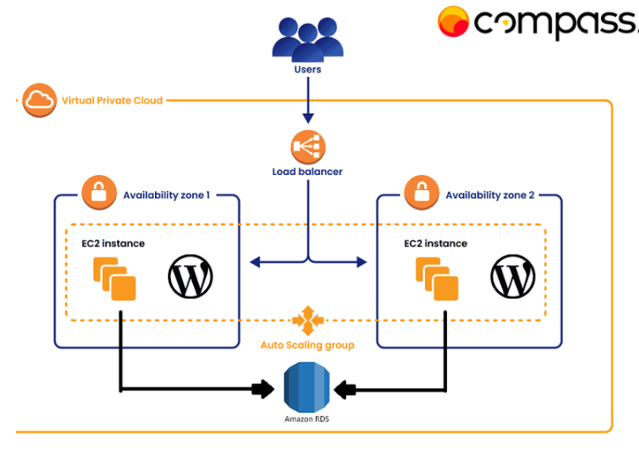
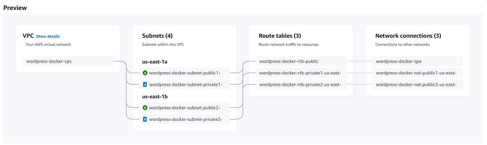
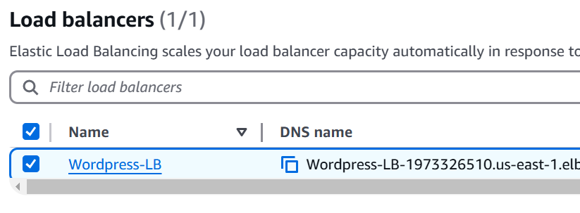
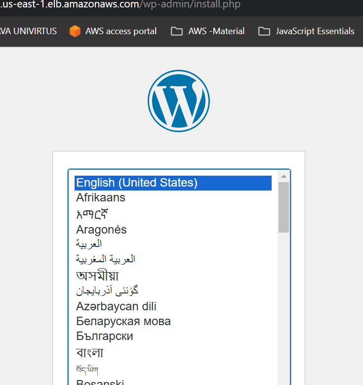

# Untitled

# Trilha de DevSecOps - Atividade Prática 2

## Documentação do segundo projeto proposto para a trilha DevSecOps do Programa de Bolsas CompassUOL, turma de Novembro de 2024.


### Objetivo

Realizar a implantação de uma aplicação WordPress com integração a um banco de dados MySQL, utilizando um container Docker no ambiente AWS. Criando uma infraestrutura escalável e altamente disponível, usando os recursos da AWS, como RDS(Relational Database Service), EFS(Elastic File System), Elastic Load Balancer e Auto Scaling Group.


## 1. Arquitetura Proposta



## 2. Configuração da VPC (Virtual Private Cloud)

### 2.1 -  Criando a VPC

- No console AWS, busque por VPC e acesse essa seção.
- Clique em `CREATE VPC`
- Dentro das configurações, selecione as seguinte opções:
    - **Name tag auto-generation:** wordpress-docker (qualquer nome desejado)
    - **IPv4 CIDR block:** 10.0.0.0/16
    - **Number of Availability Zones (AZs):** 2
    - **Number of public subnets:** 2
    - **Number of private subnets:** 2
    - **NAT gateways:** 1 per AZ - Escolhendo essa opção, as rotas serão configuradas automaticamente, pela própria AWS
- Salve as configurações feitas, clicando em  `CREATE VPC`




## 3. Configuração dos Security Groups

Para garantir a segurança de tráfego da nossa aplicação, será criando um grupo de segurança para cada serviço utilizado nesse projeto.  Assim, conseguimos personalizar as regras de acordo com a necessidade de cada grupo.

- Encontre a seção de EC2, em Network & Security clique em `SECURITY GROUPS`
- Em seguida clique em `CREATE SECURITY GROUP`
- Para todos os grupos, os **Basic Details** devem ser preenchidos basicamente da mesma forma:

|  Security group name  | Nome de acordo com o grupo |
| --- | --- |
| Description | Descrição que ajude a identificar o grupo |
| VPC  | Escolha a VPC criada para esse projeto |

### 3.1 - SG das Instâncias EC2

- **Inbound Rules :**
    - Type: HTTP
    - Porta Range: 80
    - Source Type: Custom
    - Source:  Security Group do Load Balancer
    
    - Type: HTTPS
    - Porta Range: 443
    - Source Type: Custom
    - Source:  Security Group do Load Balancer
    
- **Outbound Rules:**
    - Type: All traffic
    - Porta Range: All
    - Destination Type: Custom
    - Destination:  0.0.0.0/0

### 3.2 - SG do Banco de Dados

- **Inbound Rules :**
    - Type: MySQL/Aurora
    - Porta Range: 3306
    - Source Type: Custom
    - Source:  Security Group das Instâncias
    
- **Outbound Rules:**
    - Type: MySQL/Aurora
    - Porta Range: 3306
    - Destination Type: Anywhere IPv4
    - Destination:  0.0.0.0/0

### 3.3 - SG do Load Balancer

- **Inbound Rules :**
    - Type: HTTP
    - Porta Range: 80
    - Source Type: Anywhere-IPv4
    - Source:  0.0.0.0/0
    
    - **Type: HTTPS**
    - Porta Range: 443
    - Source Type: Anywhere-IPv4
    - Source:  0.0.0.0/0
    
- **Outbound Rules:**
    - Type: All traffic
    - Porta Range: All
    - Destination Type: Anywhere-IPv4
    - Destination:  0.0.0.0/0

### 3.4 - SG do Elastic File System

- **Inbound Rules :**
    - Type: NFS
    - Porta Range: 2049
    - Source Type: Custom
    - Source:  Security Group das Instâncias
    
- **Outbound Rules:**
    - Type: All Traffic
    - Porta Range: All
    - Destination Type: Anywhere IPv4
    - Destination:  0.0.0.0/0


## 4. Configuração do Elastic File System (EFS)

### 4.1 - Criação do sistema de arquivos

- Vá até a seção de EFS e clique em `CREATE FILE SYSTEM`
- Em seguida clique em `CUSTOMIZE`
- Escolha um nome de acordo com o projeto
- File system type: Regional
- Desmarque a opção *Enable automatic backups*. Como esse é um projeto para estudos, é recomendável desativar o backup automático para que não sejam geradas cobranças desnecessárias.
- Clique em `NEXT`
- Em **Network**  selecione a VPC criada para o projeto
- Na de  **Mount Targets**  selecione em cada Availability Zone, o security group do EFS e a subnet privada de cada zona.
- Clique em `NEXT` e em seguida `CREATE`


## 5. Configuração do Banco de Dados (RDS)

### 5.1 - Criando o Banco de Dados

- Na seção RDS, clique em `DATABASES`, então `CREATE DATABASE`
- Selecione as opções:
    - Standart create
    - Engine options: MySQL
    - Template: Free Tier
- Faça as configurações:
    - DB instance identifier: escolhe o nome de acordo com o projeto
    - Master username: defina um nome de usuário
    - Master password: defina uma senha
    - DB instance class:  db.t3.micro
    - Existing VPC security groups: selecione a VPC do Banco de Dados
    - Em **Additional Configuration** defina um nome para o Banco de Dados, caso contrário ele não será realmente criado
    - Desmarque a opção **Enable automated backups**
    - Por fim, clique em `CREATE DATABASE`


## 6. Configuração do Elastic Load Balancer

### 6.1 - Criando o Load Balancer

- Ainda na seção EC2, clique em `LOAD BALANCERS`
- Clique em `CREATE LOAD BALANCER` e escolha o tipo **Classic Load Balancer**
- Defina um nome
- Escolha o Scheme **Internet-facing**
- VPC criada para o projeto
- Marque as duas AZs e suas subnets **públicas**
- Selecione o Security Group do Load Balancer
- Em Listeners and routing, mantenha a porta 80 nos dois campos
- Clique em `CREATE LOAD BALANCER`

---

## 7. Configuração do Auto Scaling Group

- Na seção de EC2, busque por `Auto Scaling Group` e clique nessa opção
- Em seguida clique em `CREATE AUTO SCALING GROUP`
- Defina um nome para o seu grupo

### 7.1 Criando um template de instância

- Clique em Create a launch template

Vamos criar um modelo de instância, com um script de inicialização que configura a instância e instala as ferramentas necessárias para que o container Docker funcione e tenhamos a aplicação do WordPress funcionando. 

- Defina um nome para o seu template
- Defina a versão, caso queira
- Em Application and OS Images, escolheremos o Amazon Linux 2
- Instance type: t2.micro (gratuita)
- Escolha uma Key pair ou gere uma nova
- Escolha o Security Group da instâncias

```bash
#!/usr/bin/env bash

sudo yum update -y
sudo yum upgrade -y
sudo yum install -y amazon-efs-utils

mkdir -p /mnt/efs
sudo mount -t efs -o tls "*<EFS_DNS>*":/ /mnt/efs

sudo yum install docker -y
sudo usermod -a -G docker ec2-user
newgrp docker
sudo systemctl enable docker.service
sudo systemctl start docker.service

sudo curl -L [https://github.com/docker/compose/releases/latest/download/docker-compose-$](https://github.com/docker/compose/releases/latest/download/docker-compose-$)(uname -s)-$(uname -m) -o /usr/local/bin/docker-compose
sudo chmod +x /usr/local/bin/docker-compose

cat << EOF > /home/ec2-user/docker-compose.yml
services:
wordpress:
image: wordpress:latest
ports:
- "80:80"
environment:
WORDPRESS_DB_HOST: "*<RDS_ENDPOINT>*"
WORDPRESS_DB_USER: "*<DB_USER>*"
WORDPRESS_DB_PASSWORD: "*<DB_PASSWORD>*"
WORDPRESS_DB_NAME: "*<DB_NAME>*"
volumes:
- /mnt/efs/wp-content:/var/www/html/wp-content
restart: always
EOF

cd /home/ec2-user
docker-compose up -d
```

### 7.2 - Criando o Auto Scaling Group

- Volte para a página do Auto Scaling Group e selecione a instância criada
- Clique em `NEXT`
- Selecione a VPC do projeto
- Selecione as duas subnets privadas
- Clique em `NEXT`
- Loand Balancing: Attach to an existing load balancer
- Choose from Classic Load Balancers
- Selecione o Load Balancer criado anteriormente
- Clique em `NEXT`
- Desired capacity: 2
- Min desired capacity: 1
- Max desired capacity: 2
- Clique em `NEXT` até chegar em `CREATE AUTO SCALING GROUP`


## 8. Verificação de funcionamento

- Na seção Load Balancers, copie o DNS name da aplicação



- Cole o DNS name no seu navegador e carregue a página. Se tudo deu certo, a página do WordPress aparacerá para a escolha do idioma principal
- 


